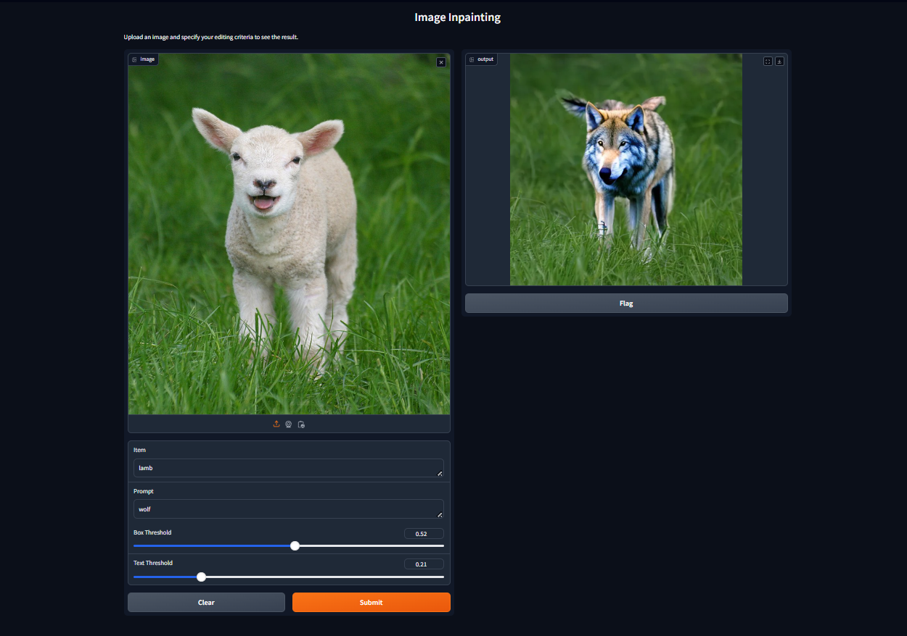

# Text-Based Image Editing 
This project explores the intersection of Natural Language Processing (NLP) and Computer Vision through advanced text-based image editing techniques. By leveraging three powerful models—Grounding DINO, Segment Anything Model (SAM), and Stable Diffusion—we aim to create an intuitive system that allows users to modify images based on textual input.

Grounding DINO: Facilitates object detection and localization within images based on text prompts, allowing for precise object targeting.

Segment Anything Model (SAM): Provides robust segmentation capabilities to isolate specific objects or regions within an image for editing.

Stable Diffusion: Handles image generation and enhancement, enabling creative transformations based on text instructions.
## Prerequisites

Before you begin, ensure you have the following installed on your system:

- [Docker](https://www.docker.com/)
- [NVIDIA Drivers](https://docs.nvidia.com/datacenter/tesla/tesla-installation-notes/index.html)
- [NVIDIA Container Toolkit](https://docs.nvidia.com/datacenter/cloud-native/container-toolkit/install-guide.html)

## Getting Started

### 1. Build the Docker Image

To build the Docker image for the inpainting project, run the following command in the project root directory (where the `Dockerfile` is located):

```bash
docker build -t image_editing .
```

### 2. Run the Docker Container with GPU Support

```bash
docker run --gpus all -p 7860:7860 image_editing
```
## Demo
- Replacing lamb with wolf.
<p align="center"></p>

