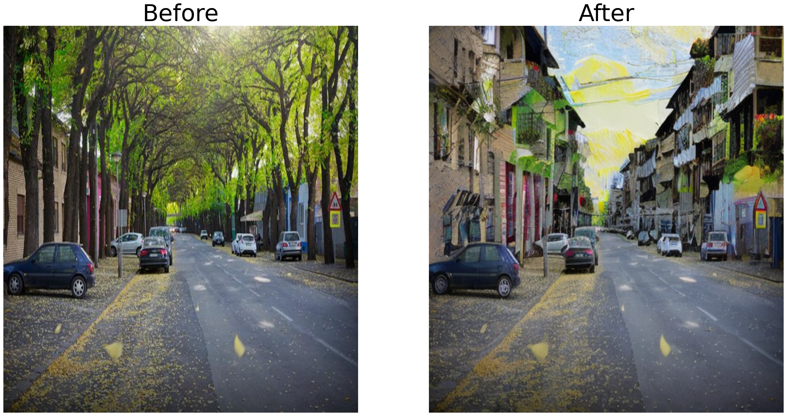

# Text-Based-Image-Editing 
Explore the intersection between Natural Language Processing and Computer Vision using: 
- Grounding DINO.
- Segment Anything Model (SAM).
- Stable Diffusion.

Here is the obtained result:
- Replacing trees with houses.

